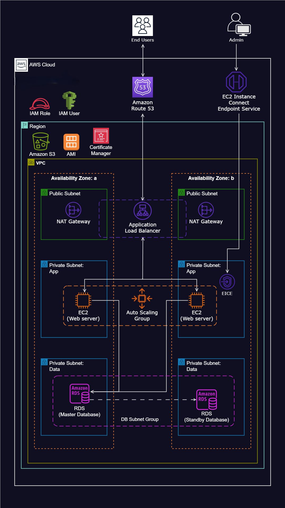

# Dynamic Website Hosting on AWS

This project showcases the deployment and hosting of a dynamic website on AWS, integrating various services and components to ensure top-notch performance, scalability, security, and fault tolerance.

## Architecture Overview

The website operates on EC2 instances within a Virtual Private Cloud (VPC) configured with both public and private subnets across two Availability Zones. The infrastructure harnesses several key AWS resources:

- **Virtual Private Cloud (VPC)**: Offers a segregated portion of the AWS cloud for launching resources.
- **Internet Gateway**: Facilitates communication between VPC instances and the internet.
- **Security Groups**: Function as virtual firewalls, regulating inbound and outbound traffic.
- **Availability Zones**: Utilized to enhance reliability and fault tolerance.
- **Public Subnets**: Host essential infrastructure components like the NAT Gateway and Application Load Balancer.
- **Private Subnets**: House the web servers (EC2 instances) for heightened security.
- **NAT Gateway**: Grants instances in private subnets internet access.
- **EC2 Instance Connect Endpoint**: Enables secure connections to EC2 instances within both public and private subnets.
- **Application Load Balancer**: Distributes incoming web traffic among multiple EC2 instances within an Auto Scaling group.
- **Auto Scaling Group**: Dynamically manages the EC2 instances hosting the website, ensuring availability, scalability, fault tolerance, and elasticity.
- **AWS Certificate Manager**: Safeguards application communications with SSL/TLS certificates.
- **Simple Notification Service (SNS)**: Dispatches notifications regarding activities within the Auto Scaling Group.
- **Route 53**: Delivers DNS services for registering and managing the website's domain name.
- **S3 Bucket**: Houses the application code and assets.

## Deployment

The deployment process for this infrastructure is automated via scripts and configuration files stored in a GitHub repository. The repository encompasses the following elements:

- **Reference Diagram**: A graphical representation of the AWS infrastructure and its constituents.
- **Deployment Scripts**: Scripts for provisioning and configuring the requisite AWS resources.

## Usage

1. Clone the GitHub repository to your local machine.
2. Follow the instructions outlined in the repository's documentation to establish the necessary AWS resources.
3. Deploy the website code and assets to the designated S3 bucket.
4. Access the website using the registered domain name.

## Contributing

Contributions to this project are encouraged. If you encounter any issues or have suggestions for enhancements, feel free to open an issue or submit a pull request in the GitHub repository.

## License

This project is licensed under the [MIT License](LICENSE).
